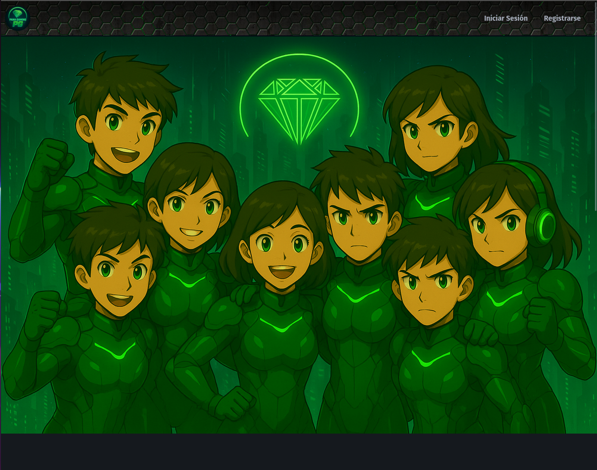

# PANA GAMING WEB

## 🌐 Pana Gaming – Plataforma Web Integrada

Se trata de una **aplicación web** en desarrollo que busca convertirse en el núcleo interactivo de una comunidad de jugadores unida por la narrativa, la cooperación y la evolución personal dentro del universo de Minecraft.

Este proyecto nace con el objetivo de conectar el servidor de Minecraft de Pana Gaming con una plataforma web moderna, donde los usuarios puedan gestionar sus personajes, seguir el desarrollo del lore, participar en eventos, y sentirse parte activa de un mundo compartido y en constante expansión.

## 🎯 Objetivo principal

Desarrollar una plataforma web que funcione como extensión del servidor de Minecraft, integrando elementos de comunidad, progreso narrativo y herramientas de interacción social, todo dentro de un entorno intuitivo, seguro e inclusivo.

## ⚙️ Características en desarrollo

- Gestión de personajes y progresos

- Diario interactivo al estilo medieval

- Panel de eventos y misiones

- Espacio para la comunidad y la narrativa compartida

Este repositorio refleja el progreso técnico y conceptual de la plataforma. Si compartes la visión o deseas aportar al proyecto, ¡eres bienvenido!

### Ayudame y apoya este proyecto!!

